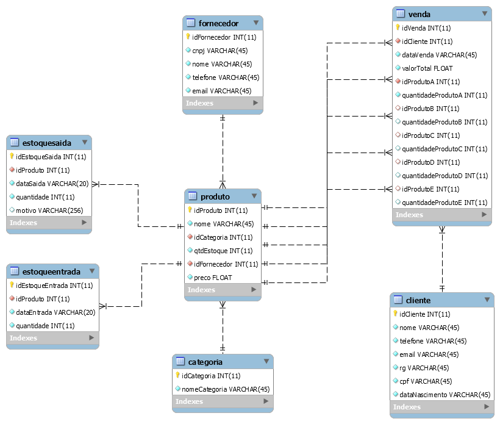

# projeto_gestao_de_vendas

Esse projeto foi destaque do segundo semestre de 2019 da Universidade São Judas Tadeu - Unidade Paulista.
O projeto envolveu as disciplinas de programação orientada a objetos e banco de dados. 

O projeto simula um sistema de gerencia de vendas e estoque.

## DER

## Autores

* **Lauren Mafi** - [Github](https://github.com/laahmf)